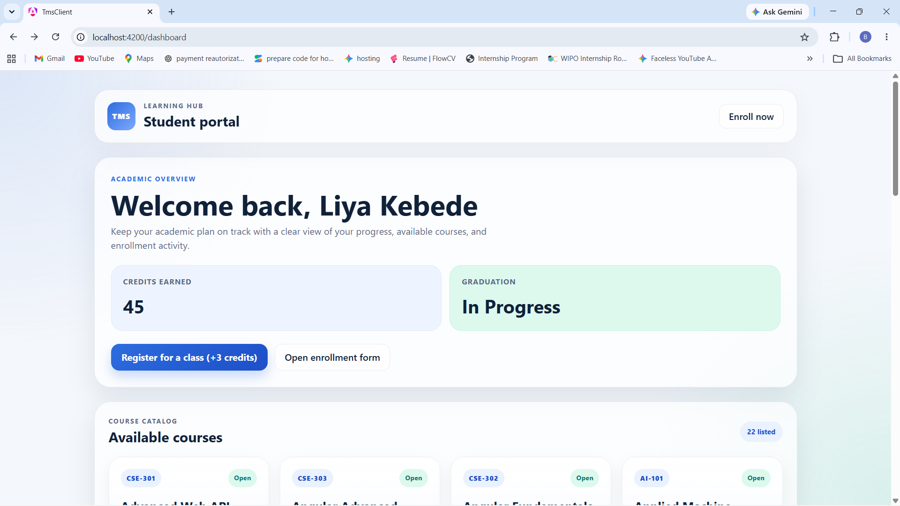
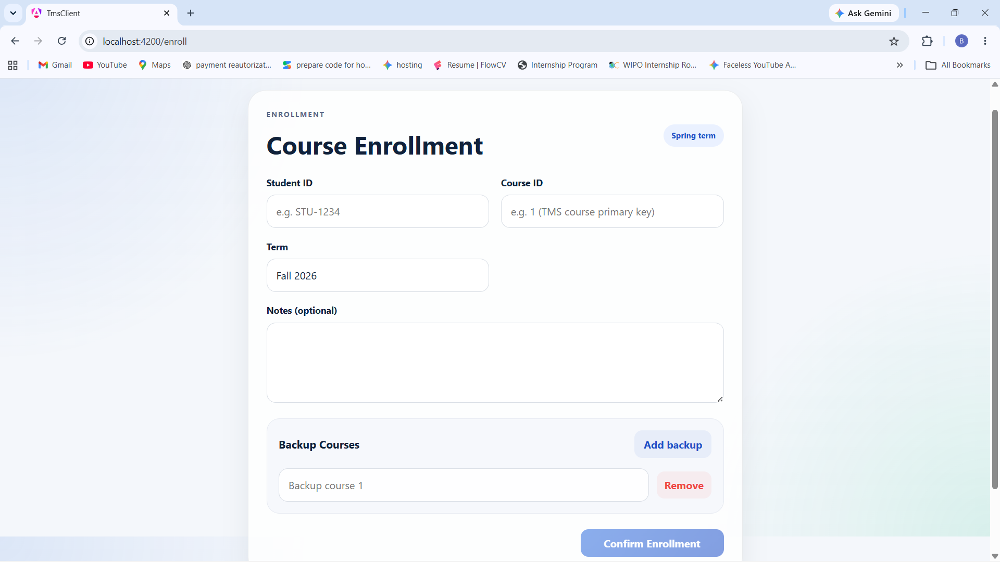
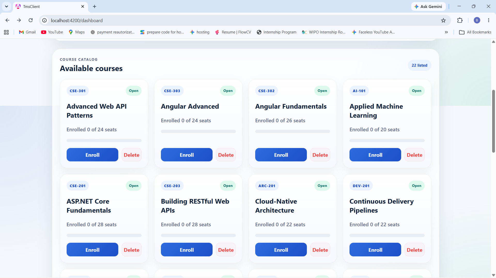

# TMS Client — Training Management System

An Angular-based frontend application for the **Training Management System (TMS)**. The application provides a responsive user interface for managing courses, enrollments, and training-related data while integrating with the TMS backend API.

The project was developed incrementally through multiple training modules, covering modern Angular development, centralized state management, performance optimization, reactive programming, real-time communication, authentication, frontend-backend integration, and automated testing.

---

## 📌 Project Overview

The TMS Client is the frontend application of the Training Management System. It communicates with the backend REST API to retrieve and manage application data and provides an interactive interface for users.

The project started with Angular fundamentals and was progressively enhanced with:

* Component-based Angular architecture
* Reusable UI components
* Services for API communication
* Angular Signals and centralized state management
* Performance optimization
* Enterprise-style data grids
* Defensive RxJS patterns
* Real-time updates using SignalR
* Environment-based API configuration
* Authentication and XSRF protection
* Unit testing with Vitest

---

## ✨ Key Features

### Angular Application Architecture

* Component-based application structure
* Reusable UI components
* Separation of pages, components, services, and state
* Angular dependency injection and service-based architecture

### Centralized State Management

* Centralized application state using **Angular Signals**
* State management using **NgRx SignalStore**
* Reactive state updates across components
* Management of enrollment and application-related state

### Reactive Programming

* RxJS-based asynchronous data handling
* Defensive RxJS patterns
* Operators such as `exhaustMap` for controlling asynchronous operations
* Reactive handling of API and application events

### Real-Time Communication

* Real-time client-server communication using **SignalR**
* WebSocket support for receiving live updates
* Synchronization of application state when server-side changes occur

### Backend API Integration

* Integration with the TMS REST API
* Environment-based API base URL configuration
* Angular services for communicating with backend endpoints
* CORS-aware frontend-backend integration

### Authentication & Security

* HTTP authentication using secure cookies
* Sending credentials with API requests
* XSRF/CSRF protection using Angular's XSRF configuration
* Authentication-related HTTP interceptor configuration

### Testing

* Unit testing using **Vitest**
* Testable Angular services and application logic
* Automated verification of frontend functionality

---

## 🧰 Tech Stack

| Technology           | Purpose                                        |
| -------------------- | ---------------------------------------------- |
| **Angular**          | Frontend framework                             |
| **TypeScript**       | Application programming language               |
| **Angular Signals**  | Reactive state handling                        |
| **NgRx SignalStore** | Centralized state management                   |
| **RxJS**             | Reactive and asynchronous programming          |
| **SignalR**          | Real-time client-server communication          |
| **SCSS**             | Styling                                        |
| **Vitest**           | Unit testing                                   |
| **Node.js / npm**    | Development environment and package management |

---

## 📚 Modules & Sessions Covered

This repository contains work completed across the following training sessions:

### Module 8 — Angular Fundamentals

* **Session 1**
* **Session 2**
* **Session 3**

Covered the Angular fundamentals and established the frontend application structure and core Angular concepts.

### Module 9 — State, Performance & Real-Time Features

* **Session 1**
* **Session 2**
* **Session 3**

Introduced more advanced frontend capabilities, including:

* Angular Signals and SignalStore
* Centralized application state
* Performance considerations
* Enterprise-style data grid functionality
* Defensive RxJS patterns
* Real-time synchronization using SignalR

### Module 10 — Full-Stack Integration

* **Session 1**
* **Session 2**
* **Session 3**

Focused on connecting the Angular application with the backend API, including:

* CORS configuration
* Environment-based API URLs
* API service integration
* Authentication using HTTP-only cookies
* Credentials handling
* XSRF protection
* Authentication interceptors

### Module 11

* **Session 3**

Frontend work related to the authentication/identity portion of the project.

### Module 12

* **Session 2**

Frontend testing work, including unit testing with **Vitest**.

---

## 📂 Project Structure

```text
src/
├── app/
│   ├── components/       # Reusable UI components
│   ├── pages/            # Application pages and views
│   ├── services/         # API and application services
│   └── store/            # SignalStore and application state
│
├── assets/               # Static application assets
├── environments/         # Environment-specific configuration
│
├── index.html            # Main HTML document
├── main.ts               # Application entry point
└── styles.scss           # Global styles
```

> The exact structure may evolve as additional modules and features are implemented.

---

## ⚙️ Getting Started

### Prerequisites

Make sure the following are installed:

* **Node.js**
* **npm**
* **Angular CLI**

The project was developed using a modern Angular and Node.js environment.

### Clone the Repository

```bash
git clone https://github.com/Beenat7/Tms-Client-M8.git
cd Tms-Client-M8
```

### Install Dependencies

```bash
npm install
```

### Start the Development Server

```bash
ng serve
```

The application will normally be available at:

```text
http://localhost:4200
```

> The backend API must also be running for features that require server communication.

---

## 🧪 Testing

The project uses **Vitest** for frontend unit testing.

Run the test suite with:

```bash
ng test
```

Tests are used to verify frontend application behavior and help prevent regressions as new modules and features are introduced.

---

## 🏗️ Build

To create a production build:

```bash
ng build
```

The generated production files are placed in the project's `dist/` directory.

---

## 📸 Screenshots

Screenshots of the application are included below to demonstrate the implemented user interface and major functionality.

### Dashboard



### Enrollment 



### Available Courses



---

## 🔗 Backend

The Angular client communicates with the **TMS backend API** for application data, authentication, and other server-side functionality.

The backend repository can be linked here:

**TMS Backend:**
*Add your backend GitHub repository link here.*

---

## 🎯 Project Goals

The main goal of this project is to build a modern, maintainable Training Management System while applying concepts introduced throughout the training modules.

The project demonstrates the progression from basic Angular development to more advanced frontend engineering practices, including:

* Reactive state management
* API integration
* Authentication and security
* Real-time communication
* Performance optimization
* Defensive asynchronous programming
* Automated testing

---

## 👩‍💻 Author

**Beenatlay Nigussie**

GitHub: [@Beenat7](https://github.com/Beenat7)
